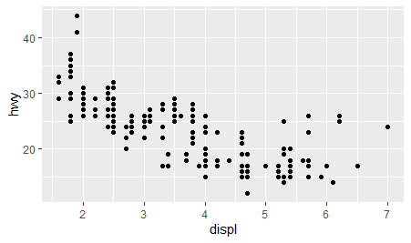
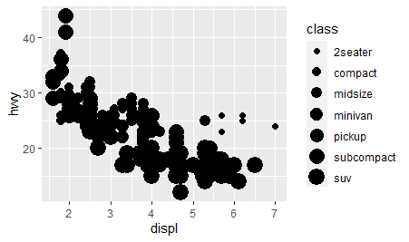
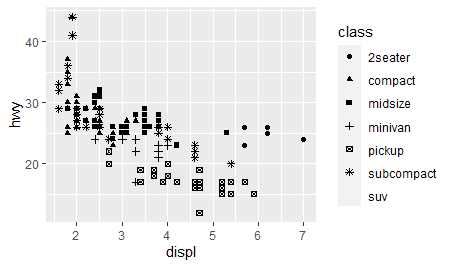

```{r setup, include=FALSE}
library(learnr)
library(gradethis)
tutorial_options(exercise.checker = gradethis::grade_learnr)
knitr::opts_chunk$set(echo = FALSE)
library(tidyverse)
```


#Topic 1

## easy

### question 1


write the code that will load tidyverse:

```{r two-plus-two, exercise=TRUE}

```
```{r two-plus-two-hint-1}
"first part is library()"

```
```{r two-plus-two-hint-2}
"you need to insert the word tidyverse"
```

```{r two-plus-two-solution}
library(tidyverse)
```
```{r two-plus-two-check}
gradethis::grade_code()
```


### question 2

if you want learn more about the variables in mpg which code should you run

```{r two-plus-three, exercise=TRUE}

```
```{r two-plus-three-hint-1}
"use the ? sign"
```

```{r two-plus-three-solution}
?mpg
```

```{r two-plus-three-check}
gradethis:: grade_code()
```

## Intermediate

### question 3
<!--  -->


enter the code that creates the above graph

```{r two-plus-four, exercise=TRUE}

```

```{r two-plus-four-hint-1}
"you need to use both ggplot() and ggplot_point()"
```

```{r two-plus-four-hint-2}
"ggplot(data = mpg) + 
  geom_point(mapping = aes(x= , y= ))"
```

```{r two-plus-four-solution}
ggplot(data = mpg) + 
  geom_point(mapping = aes(x = displ, y = hwy))
```

```{r two-plus-four-check}
gradethis:: grade_code()
```

### question 4

<!--  -->


complete the code to create the above graph

```{r two-plus-five, exercise=TRUE}

ggplot(data = mpg) + 
  geom_point(mapping = aes(x = displ, y = hwy, ))
             
```

```{r two-plus-five-hint-1}
"missing part is size"
```

```{r two-plus-five-solution}
ggplot(data = mpg) + 
  geom_point(mapping = aes(x = displ, y = hwy, size = class))
```
```{r two-plus-five-check}
gradethis:: grade_code()
```

  
  

## hard

### question 5

<!--  -->


run the code that creates the graphs above

```{r two-plus-six, exercise=TRUE}

```
```{r two-plus-six-hint-1}
"you need to add shape = class"
```
```{r two-plus-six-solution}
ggplot(data = mpg) + 
  geom_point(mapping = aes(x = displ, y = hwy, shape = class))
```
```{r two-plus-six-check}
gradethis:: grade_code()
```
