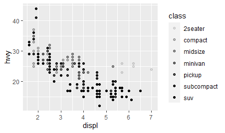

```{r setup, include=FALSE}
library(learnr)
knitr::opts_chunk$set(echo = FALSE)
```


#Topic 1

## easy

### question 1


write the code that will load tidyverse:

```{r two-plus-two, exercise=TRUE}

```

### question 2

if you want learn more about the variables in mpg which code should you run

```{r two-plus-three, exercise=TRUE}

```

## Intermediate

### question 3
<!--  -->


enter the code that creates the above graph

```{r two-plus-four, exercise=TRUE}

```

### question 4

<!--  -->


complete the code to create the above graph

```{r two-plus-five, exercise=TRUE}

ggplot(data = mpg) + 
  geom_point(mapping = aes(x = displ, y = hwy, ))
             
```

## hard

### question 5

<!--  -->


<!--  -->


run the 2 codes that creates the graphs above

```{r two-plus-six, exercise=TRUE}

```
