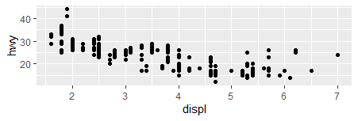

```{r setup, include=FALSE}
library(learnr)
library(gradethis)
tutorial_options(exercise.checker = gradethis::grade_learnr)
knitr::opts_chunk$set(echo = FALSE)
library(tidyverse)
library(nycflights13)
```


#Learnrexercises

## easy

### question 1 (question for ex 3.3.1)


write the code that will load tidyverse:

```{r two-plus-two, exercise=TRUE}

```
```{r two-plus-two-hint-1}
"first part is library()"

```
```{r two-plus-two-hint-2}
"you need to insert the word tidyverse"
```

```{r two-plus-two-solution}
library(tidyverse)
```
```{r two-plus-two-check}
gradethis::grade_code()
```


### question 2 (question for ex 3.3.1)

if you want learn more about the variables in mpg which code should you run

```{r two-plus-three, exercise=TRUE}

```
```{r two-plus-three-hint-1}
"use the ? sign"
```

```{r two-plus-three-solution}
?mpg
```

```{r two-plus-three-check}
gradethis:: grade_code()
```

### question 3 (question for ex 3.6.1)
```{r quiz1a}
question("which is geom?",
  answer("A geom is the geometrical object that a plot uses to represent data", correct = TRUE),
  answer("is a german car"),
  answer("is a programing language")
)
```

### question 4 (questions for ex 3.6.1)
<!--  -->


run the code to create the above graph using ggplot()


```{r two-plus-eight, exercise=TRUE}

```

```{r two-plus-eight-solution}
ggplot(data = mpg) + 
  geom_point(mapping = aes(x = displ, y = hwy))
```

```{r two-plus-eight-check}
gradethis:: grade_code()
```

### question 5 (question for ex 5.2.4)

Write the code to find the flights that had an arrival delay of 60 minutes or more.

```{r two-plus-8a, exercise=TRUE}

```
```{r two-plus-8a-hint-1}
"filter(flights, arr_delay >="
```

```{r two-plus-8a-solution}
filter(flights, arr_delay >= 60)
```
```{r two-plus-8a-check}
gradethis::grade_code()
```

### question 6 (question for ex 5.3.1)

Sort flights to find the most delayed flights. 

```{r two-plus-1a, exercise=TRUE}

```
```{r two-plus-1a-hint-1}
"use desc( ))"
```
```{r two-plus-1a-solution}
arrange(flights, desc(dep_delay))
```
```{r two-plus-1a-check}
gradethis::grade_code()
```

### question 7 (question for ex 5.4.1)

Use any_of () function to find dep_delay and dep_time vectors. 

```{r two-plus-1b, exercise=TRUE}

```

```{r two-plus-1b-hint-1}
"select(flights, any_of(c()))"
```

```{r two-plus-1b-solution}
select(flights, any_of(c("dep_time", "dep_delay", "arr_time", "arr_delay")))
```

```{r two-plus-1b-check}
gradethis::grade_code()
```

### question 8 (question for ex 5.5.2)

```{r quiz2b}
question("what would the following code 1504 %/% 100 give",
  answer("[1] 15", correct = TRUE),
  answer("[1] 4"),
  answer("150,400"),
  answer("15.04")
)
```

### question 9 (question for ex 5.6.7)

```{r quiz1e}
question("which delay may prove costlier to customer?",
  answer("arrival delay", correct = TRUE),
  answer("departure delay")
)
```

## Intermediate

### question 10
<!--  -->


enter the code that creates the above graph

```{r two-plus-four, exercise=TRUE}

```

```{r two-plus-four-hint-1}
"you need to use both ggplot() and ggplot_point()"
```

```{r two-plus-four-hint-2}
"ggplot(data = mpg) + 
  geom_point(mapping = aes(x= , y= ))"
```

```{r two-plus-four-solution}
ggplot(data = mpg) + 
  geom_point(mapping = aes(x = displ, y = hwy))
```

```{r two-plus-four-check}
gradethis:: grade_code()
```

### question 11

<!--  -->


complete the code to create the above graph

```{r two-plus-five, exercise=TRUE}

ggplot(data = mpg) + 
  geom_point(mapping = aes(x = displ, y = hwy, ))
             
```

```{r two-plus-five-hint-1}
"missing part is size"
```

```{r two-plus-five-solution}
ggplot(data = mpg) + 
  geom_point(mapping = aes(x = displ, y = hwy, size = class))
```
```{r two-plus-five-check}
gradethis:: grade_code()
```

### question 12 (question for ex 3.6.1)
<!--  -->


fix the code to create the graph above

```{r two-plus-nine, exercise=TRUE}
ggplot(data = mpg) + 
  geom_point(mapping = aes(x = displ, y = hwy, linetype = drv))
```
```{r two-plus-nine-hint-1}
"try geom _smooth() rather than geom_point()"
```

```{r two-plus-nine-solution}
ggplot(data = mpg) + 
  geom_smooth(mapping = aes(x = displ, y = hwy, linetype = drv))
```

```{r two-plus-nine-check}
gradethis:: grade_code()

```

### question 13 (question for ex 3.6.1)
<!--  -->


create the above graph

```{r two-plus-ten, exercise=TRUE}

```

```{r two-plus-ten-hint-1}
"ggplot(data = mpg, mapping = aes(x = displ, y = hwy)) + "
```

```{r two-plus-ten-solution}
ggplot(data = mpg, mapping = aes(x = displ, y = hwy)) + 
  geom_point() + 
  geom_smooth()
```

```{r two-plus-ten-check}
gradethis::grade_code()

```

### question 14 (question for ex 5.2.4)

wirte the code to find flights that departed between January and August

```{r two-plus-threea, exercise=TRUE}

```
```{r two-plus-threea-hint-1}
filter(flights, month >= , month <= )
```
```{r two-plus-threea-solution}
filter(flights, month >= 7, month <= 9)
```
```{r two-plus-threea-check}
gradethis::grade_code()
```

### question 15 (question for ex 5.3.1)

write the code to find the Flights that left the earliest.

```{r two-plus-2a, exercise=TRUE}

```
```{r two-plus-2a-hint-1}
"the code looks similiar to the answer of question 1"
```
```{r two-plus-2a-solution}
arrange(flights, dep_delay)
```
```{r two-plus-2a-check}
gradethis::grade_code()
```

### question 16 (question for ex 5.4.1)

find the vectors dep_time, dep_delay, arr_time, arr_delay without using dep_time, dep_delay, arr_time, arr_delay in the function,, use the starts_with()function.

```{r two-plus-2b, exercise=TRUE}

```
```{r two-plus-2b-solution}
select(flights, starts_with("dep_"), starts_with("arr_"))
```
```{r two-plus-2b-check}
gradethis::grade_code()
```

### question 17 (question for ex 5.5.2)

```{r quiz1c}
question(" what does the following give us 1:3 + 1:10",
  answer("[1]  2  4  6  5  7  9  8 10 12 11", correct = TRUE),
  answer("[1]  2  4  6  5  7  9  9 10 12 11"),
  answer("[1]  2  3  4  5  6  7  8 9 10 11"),
  answer("gives us nothing")
)
```

### question 18 (question for ex 5.6.7)


write the code to show Which carrier has the worst delays(arr_delay)?

```{r two-plus-foura, exercise=TRUE}

```
```{r two-plus-foura-hint-1}
"flights %>% group_by(carrier, dest) %>% summarise(n())"
```
```{r two-plus-foura-solution}
flights %>%
  group_by(carrier) %>%
  summarise(arr_delay = mean(arr_delay, na.rm = TRUE)) %>%
  arrange(desc(arr_delay))
filter(airlines, carrier == "F9")
```
```{r two-plus-foura-check}
gradethis::grade_code()
```


## hard 

### question 19

<!--  -->


run the code that creates the graphs above

```{r two-plus-six, exercise=TRUE}

```
```{r two-plus-six-hint-1}
"you need to add shape = class"
```
```{r two-plus-six-solution}
ggplot(data = mpg) + 
  geom_point(mapping = aes(x = displ, y = hwy, shape = class))
```
```{r two-plus-six-check}
gradethis:: grade_code()
```

### question 20 (question for ex 3.6.1)

<!--  -->


finish the code to create the above graph

```{r two-plus-zero, exercise=TRUE}
ggplot(data = mpg, mapping = aes(x = displ, y = hwy)) + 
  geom_point(mapping = aes(color = class)) + 
  geom_smooth(
```

```{r two-plus-zero-hint-1}
"you have to use the filter()"

```

```{r two-plus-zero-solution}
ggplot(data = mpg, mapping = aes(x = displ, y = hwy)) + geom_point(mapping = aes(color = class)) + geom_smooth(data = filter(mpg, class =="subcompact"), se = FALSE)  
```

```{r two-plus-zero-check}
gradethis:: grade_code()

```

### question 21 (question for ex 5.2.4)

find the flights that Departed between midnight and 6am (inclusive).

```{r two-plus-fourb, exercise=TRUE}

```
```{r two-plus-fourb-solution}
summary(flights$dep_time)
filter(flights, dep_time <= 600 | dep_time == 2400)
c(600, 1200, 2400) %% 2400
filter(flights, dep_time %% 2400 <= 600)
```

```{r two-plus-fourb-check}
gradethis::grade_code()
```

### question 22 (question for ex 5.3.1)

show top 10 flights that traveled the farthest and top 10 that traveled the shortest?

```{r two-plus-3a, exercise=TRUE}

```
```{r two-plus-3a-hint-1}
"The answer follows the same idea as the answer for number 1 and 2"
```
```{r two-plus-3a-solution}
arrange(flights, desc(distance))
arrange(flights, distance)
```
```{r two-plus-3a-check}
gradethis::grade_code()
```

### question 23 (question for ex 5.41)

use the !! operator in a function to find the vectors of "dep_time", "dep_delay", "arr_time", "arr_delay".

```{r two-plus-3b, exercise=TRUE}

```
```{r two-plus-3b-hint-1}
 "Specify the names of the variables with a character vector and use the bang-bang operator (use c as a name for the variables) (!!)."
```
```{r two-plus-3b-solution}
variables <- c("dep_time", "dep_delay", "arr_time", "arr_delay")
select(flights, !!variables)
```
```{r two-plus-3b-check}
gradethis::grade_code()
```

### question 24 (question for ex 5.5.2)

Compare dep_time, sched_dep_time, and dep_delay. 

```{r two-plus-1d, exercise=TRUE}

```

```{r two-plus-1d-solution}
flights_deptime <-
  mutate(flights,
    dep_time_min = (dep_time %/% 100 * 60 + dep_time %% 100) %% 1440,
    sched_dep_time_min = (sched_dep_time %/% 100 * 60 +
      sched_dep_time %% 100) %% 1440,
    dep_delay_diff = dep_delay - dep_time_min + sched_dep_time_min
  )
filter(flights_deptime, dep_delay_diff != 0)
```

```{r two-plus-1d-check}
gradethis::grade_code()
```

### question 25 (questions for ex 5.6.7)

What time of day should you fly if you want to avoid delays as much as possible?
 
 ```{r two-plus-fivec, exercise=TRUE}

```
```{r two-plus-fivec-solution}
flights %>%
  group_by(hour) %>%
  summarise(arr_delay = mean(arr_delay, na.rm = TRUE)) %>%
  arrange(arr_delay)
```
```{r two-plus-fivec-check}
gradethis::grade_code()
```

