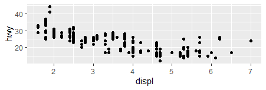

```{r setup, include=FALSE}
library(learnr)
library(gradethis)
tutorial_options(exercise.checker = gradethis::grade_learnr)
knitr::opts_chunk$set(echo = FALSE)
library(tidyverse)
```

## Easy

### question 1
```{r quiz}
question("which is geom?",
  answer("A geom is the geometrical object that a plot uses to represent data", correct = TRUE),
  answer("is a german car"),
  answer("is a programing language")
)
```

```{r two-plus-seven, exercise=TRUE}

```

### question 2
<!--  -->


run the code to create the above graph using ggplot()


```{r two-plus-eight, exercise=TRUE}

```

```{r two-plus-eight-solution}
ggplot(data = mpg) + 
  geom_point(mapping = aes(x = displ, y = hwy))
```

```{r two-plus-eight-check}
gradethis:: grade_code()
```

## intermadate


### question 3
<!--  -->


fix the code to create the graph above

```{r two-plus-nine, exercise=TRUE}
ggplot(data = mpg) + 
  geom_point(mapping = aes(x = displ, y = hwy, linetype = drv))
```
```{r two-plus-nine-hint-1}
"try geom _smooth() rather than geom_point()"
```

```{r two-plus-nine-solution}
ggplot(data = mpg) + 
  geom_smooth(mapping = aes(x = displ, y = hwy, linetype = drv))
```

```{r two-plus-nine-check}
gradethis:: grade_code()

```

### question 4
<!--  -->


create the above graph

```{r two-plus-ten, exercise=TRUE}

```

```{r two-plus-ten-hint-1}
"ggplot(data = mpg, mapping = aes(x = displ, y = hwy)) + "
```

```{r two-plus-ten-solution}
ggplot(data = mpg, mapping = aes(x = displ, y = hwy)) + 
  geom_point() + 
  geom_smooth()
```

```{r two-plus-ten-check}
gradethis::grade_code()

```


## Hard

### question 5


<!--  -->


finish the code to create the above graph

```{r two-plus-zero, exercise=TRUE}
ggplot(data = mpg, mapping = aes(x = displ, y = hwy)) + 
  geom_point(mapping = aes(color = class)) + 
  geom_smooth(
```

```{r two-plus-zero-hint-1}
"you have to use the filter()"

```

```{r two-plus-zero-solution}
ggplot(data = mpg, mapping = aes(x = displ, y = hwy)) + geom_point(mapping = aes(color = class)) + geom_smooth(data = filter(mpg, class =="subcompact"), se = FALSE)  
```

```{r two-plus-zero-check}
gradethis:: grade_code()

```